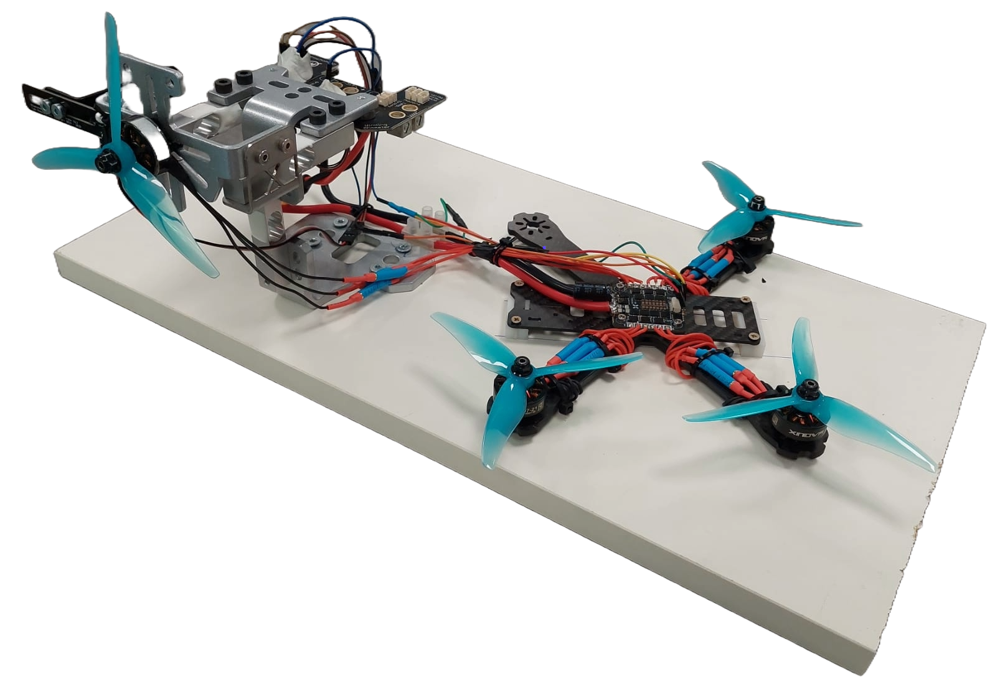

  <h1 align="center">A Comparative Study on Thrust Map Estimation for
Multirotor Aerial Vehicles </h1>
    

    <a href=><light>Francisco J. Anguita</light></a>
    ·
    <a href=><light>Rafael Perez-Segui</light></a>
    ·
    <a href=><light>Carmen DR.Pita-Romero</light></a>
    ·
    <a href=><light> Miguel Fernandez Cortizas</light></a>
    .
    <a href=><light>Javier Melero-Deza</light></a>
    .
    <a href=><light>Pascual Campoy</light></a>
    ·
  

 <h3 style="text-align: center;">
  <a href="#">In Progress Paper</a> | 
  <a href="https://vimeo.com/1104217611/ce4e5d3f6c">Video</a>
</h3> 

 

  

This repository holds all the tools and procedures necessary to estimate a thrust map using a thrust stand for offline data recording. It also contains the necessary tools to compute a correction factor using data from real experiments to correct errors derived from the estimated thrust stand.

## Thrust Stand utils

The [thrust_stand](./thrust_stand/) folder contains the scripts used to carry out the experiments on the thrust stand so they can be replicated, as well as some test data obtained for a specific motor model and all the scripts used to fit and test the polynomial surface for the Thrust Map.

## Correction Factor utils

The [correction_factor](./correction_factor/) folder contains the necessary scripts to compute the correction factor from data saved in a ROS bag or CSV file. More details are inside. It can also compare results obtained with flights that used different approximations for the trust stand and flights that used the correction factor.
