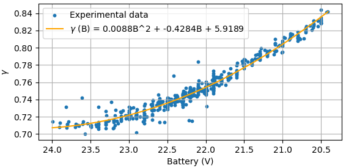

# Experiments to estimate the correction factor for the thrust stand
 
 The scripts that process the data for real flights to compute the correction factor curve and use it with the thrust map.
<div align="center">
  
</div>

## Prerequisites

In order to read a Rosbag it must be record using [Aerostack2](https://github.com/aerostack2/aerostack2) with the following topics:
  - "actuator_command/thrust"
  - "sensor_measurements/imu"
  - "sensor_measurements/battery"
  - "debug/controller_reference"
  - "debug/controller_state"
  - "debug/rc/command"
  - "platform/info"
  - "self_localization/pose"

If you want to calculate the correction factor using your own data, organize it in a csv file with the following header and arrange the data in columns.

`
Thrust sended (N),Thrust measured (N),Voltage (V),Acc (m/s²),m (Kg),Throttle (%),Position_z (m),Time (s)
`
## Usage
These scripts enable you to work with ROSBags from flight tests, using either a linear or a second-order approximation of the thrust map and compute the corresponding correction factor. If the flights were recorded with the correction factor active, the scripts can also generate results for comparison.

### Obtain the correction factor
To obtain the correction factor, first you must either configure the default configuration or create a custom one. 
The configuration file must include these parameters:
```
rosbags:
  file1: 'path1'  
  file2: 'path2'  
    .
    .
    .
folder_experiment: 'folder_name'   
T_max: false  # For Linear aproximation it must be 44 to use it or false
cf_parameters: False # Put False and comment the parameters if the correction factor have not been yet computed
  # a2: 5.91892324          
  # a1: -0.42842818
  # a0:  0.00880309
tm_parameters:           # Parameters for the thrust map surface      
  a: 368.38174446706694
  b: 275.9120443657675
  c: 64.33013450010587
  d: -8.020752230795884
  e: -7.162085176021985
  f: -1.3041691088519118
read_only_csv: False  # If true, the code will read the csv files instead of the rosbag file
mass: 1.254
z_ref: 1.0
```
The rosbags should contain the paths to the folders with the experimental data recorded with the same thrust map.

The script will read the rosbags and save the data from each experiment in a CSV file with the name written in the configuration file. These files will be stored in a folder named "folder_experiment" inside a data folder.

To compute the correction factor, "cf_parameters" must be set to False, and the parameters must be disabled.
All experiments are unified in a single CSV file under the name "folder_experiment" in the "data/results" folder to compute this correction factor. Its curve will be plotted.

Then, the correction factor is used with the data from each experiment to plot a graph comparing the expected thrust, the thrust commanded by the controller, and the thrust computed with the data measured by the IMU.

Additionally, the discharge of the battery over time and the actual position in the z-axis versus the commanded reference set in the configuration file with the parameter "z_ref" will be plotted for each experiment.

It will also compute the error between the commanded throttle and the computed throttle with respect to the battery level, as well as with respect to the commanded thrust. Additionally, it will compute the error between the commanded thrust and the measured thrust. All these results will be saved in the data/errors folder under the experiment’s name, with the suffix _errors.

**Note 1:**
Update the "mass" parameter with the actual drone's value to correctly compute thrust with IMU data.

**Note 2:** 
Update the thrust map parameters used in the experiments.


To run the script:


 ```bash
python3 correction_factor/scripts/main.py --config correction_factor/config/config_default.yaml
```

### Experiments recorded with a correction factor.

If the recorded experiments have already used a correction factor curve, you must edit the configuration file.

```bash
cf_parameters: 
    a2: 5.91892324          
    a1: -0.42842818
    a0:  0.00880309
```
The "cf_parameters" parameter must contain the second-degree curve variables of the correction factor.

γ = a0 · B² + a1 · B + a2

Add the parameters of the corresponding thrust map or the linear approximation.

Then run:

 ```bash
python3 correction_factor/scripts/main.py --config correction_factor/config/config_default.yaml
```
The script will do the same, but the graph to compare the thrust only will contain the thrust commanded and the thrust computed with th IMU's data. 

## Experiments recorded with the linear approximation.
If the recorded experiments use the linear approximation, set the 'T_max' parameter to the maximum thrust value and disable the 'cf_parameters'.

Then run:

 ```bash
python3 correction_factor/scripts/main.py --config correction_factor/config/config_default.yaml
```
The script will do the same, but the graph to compare the thrust only will contain the thrust commanded and the thrust computed with th IMU's data. 

**IMPORTANT:**
In the three cases. If you have already read the rosbags files, you can only read the CSV files by enabling "read_only_csv" in the configuration file. This allows you to manually delete unnecessary data from the files but obtain the same graphs ans erros.

## Compare results from different experiments

To compare the results of different experiments using various thrust maps with or without a correction factor or a linear approximation, run:

 ```bash
python3 correction_factor/scripts/compare_results.py 
```
This will access the errors folder and plot the error metrics from the different experiments.