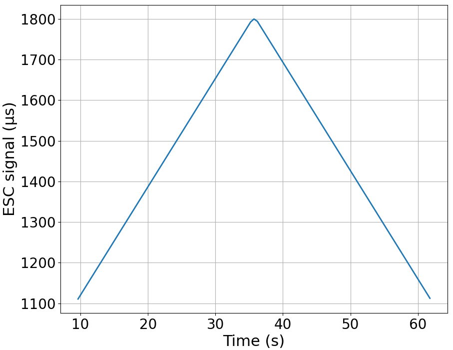
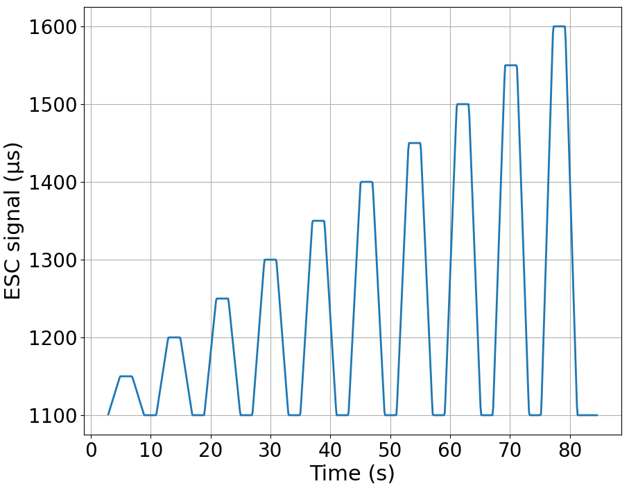
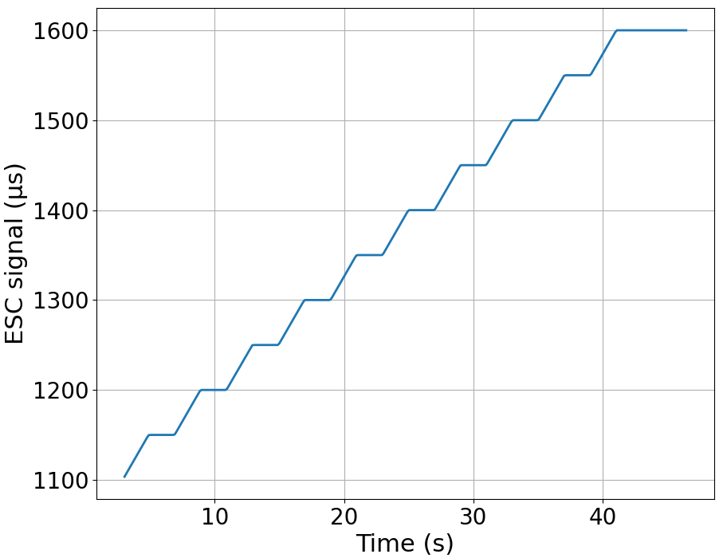

# Experiments using RCbenchmark

The thrust stand used to record the test data of this repository works with the [RCbenchmark](https://www.tytorobotics.com/pages/rcbenchmark-software?srsltid=AfmBOoplVTaXTnj7UVUPZncaaGceY2aUXAr7xT3j2jto4vNWKTdj7LbD) software application. This software allows the loading of scripts to automate experiments. The experiment scripts used in the tests are these:

- [rcb_ThrustMap_ramp](./rcb_ThrustMap_ramp.js): performs a continuous ramp between specified minimum and maximum throttle values in a given time. Additional options allow to also perform a descending ramp, or perform consecutive ramps.
- [rcb_ThrustMap_steps](./rcb_ThrustMap_steps.js): performs a series of steps, returning to a low throttle level after each step. The steps are performed at increasingly high levels. The maximum and minimum values, as well as the increment between steps can be configured.
- [rcb_ThrustMap_stepsUp](./rcb_ThrustMap_stepsUp.js) and [rcb_ThrustMap_stepsDown](./rcb_ThrustMap_stepsDown.js): performs a series of steps without returning to a low level throttle between steps. The steps in `stepsUp` are increasingly high, while the ones in `stepsDown` decrease along the experiment.

  