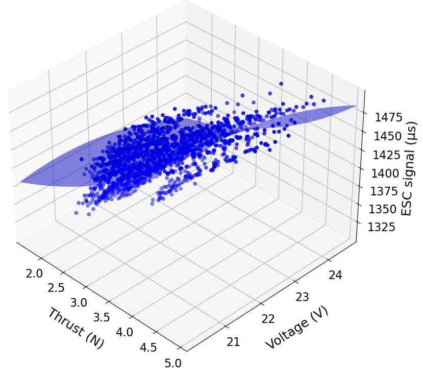
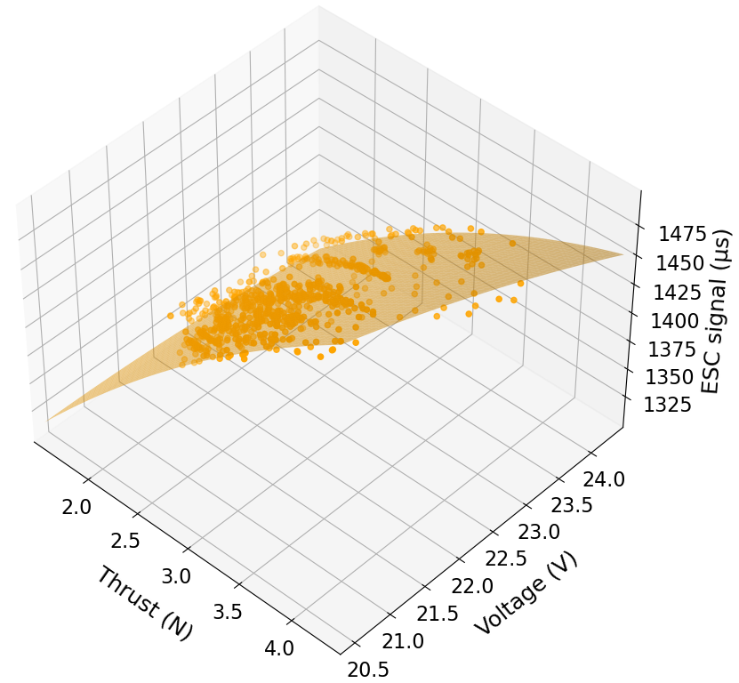

# Thrust stand experiments for Thrust Map estimation

The scripts that process the thrust stand data and turn them into a polynomial Thrust Map are found here.

 

## Usage

To obtain the coefficients for the polynomial surface that characterizes the Thrust Map, simply run:

```
python3 thrust_map_fit.py -d <path/to/data/directory> -c <path/to/config/file>
```

This will take all the data `.csv` files in the given directory and combine them to use them all for the surface fitting. Alternatively, you can run:

```
python3 thrust_map_fit.py -f <path/to/data/file1> <path/to/data/file2> ... -c <path/to/config/file>
```

to pass a list of specific files you want to use for the polynomial surface fitting.

By default, this script will perform the fitting and output the resulting coefficientes to a text file. A configuration file can be used to set data filters and activate more options. The [default configuration](config/default_config.yaml) looks like this:

```
combined_data_file: null  # combined data filename. If null, no data is saved.
coefficients_file: null   # coefficients file name. Default is coefficients.txt
poly_deg: 2nd             # degree of the desired polynomial to fit
compute_error: true       # save a report file with fitting error and stddev
plot_results: true        # plot resulting fitted surface

data_filter:
  min_thrust: 0.0         # discard all data rows with thrust below this threshold 
  max_thrust: 11.0        # discard all data rows with thrust above this threshold        
  min_volt: 20.4          # discard all data rows with voltage below this threshold
  max_volt: 25.2          # discard all data rows with voltage above this threshold
  min_throttle: 1300      # discard all data rows with throttle below this threshold
  max_throttle: 1500      # discard all data rows with throttle above this threshold

plotting:
  color: orange           # color for the plotted data and surface
```

- `combined_data_file`: saves all the combined data from the different input `.csv` files into a file with the given name. If `null` (default) the combined data will not be saved.
- `coefficients_file`: name of the file with the stored coefficients resulted from the polynomial fitting that will be saved to the 'results' folder. Default name is 'coefficients.txt'.
- `poly_deg`: degree of the polynomial surface to be fitted. Default is a 2nd degree polynomial. Only polynomial between 1st and 4th degree are valid.
- `compute_error`: if true, generates a report with the Mean Absolute Error and the Standard Deviation of the fitting of the polynomial to the input data in the 'results' folder. Default is false.
- `plot_results`: if true, shows a 3D plot of the fitted surface and the input data.
- `data_filter`: allows to specify maximum and minimum values of thrust, voltage and throttle to filter the data.
- `plotting`: options for the plots, like the color of the data and the surface.

## Recording data form the thrust stand

The scripts in this repository assume that your data is stored in `.csv` files that have, at least, the following three columns with these exact same names:
- Voltage (V)
- Thrust (N)
- ESC signal (µs)

This is the same format of the data recorded by RCbenchmark software used to record the test data provided with this repository. For more information on the recording of data using RCbenchmark see the [RCbenchmark](./RCbenchmark/) section.